<div align="center">

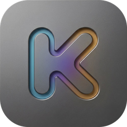

# Kultr

**A modern, minimalist web client for [Navidrome](https://www.navidrome.org/).**

Mirrors your whole library locally, crossfades properly, and mixes tracks like a DJ.

*Vibecoded with [Claude Code](https://claude.ai/code).*

[Try the live demo](https://web.kultr.cc/) · [Android app](https://github.com/evropiani/Kultr_Android) · [Install](#install) · [InjeKt](#injekt) · [Changelog](CHANGELOG.md) · [Troubleshooting](docs/TROUBLESHOOTING.md)

Questions or ideas? Find me on Discord: [@evropiani](https://discord.com/users/319246364246540288)

</div>

---

> **The demo is the real app.** It runs entirely in your browser and connects to
> *your* Navidrome server. It stores nothing, ships no music, and has no backend
> — if you would rather not trust a page on the internet with your password,
> [run it yourself](#install); it takes about a minute.

## A look at it

|  |  |
|---|---|
| 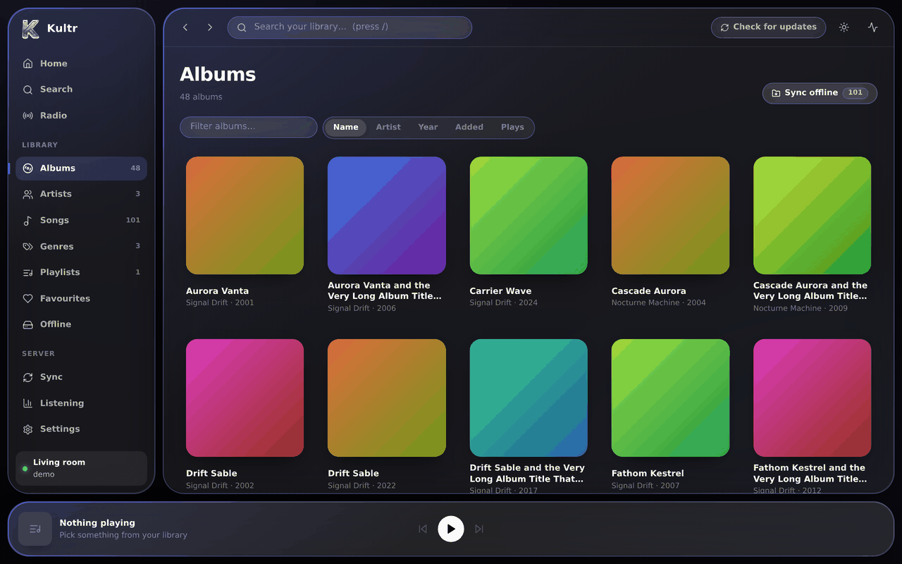 | 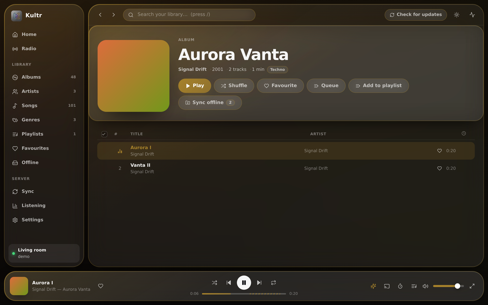 |
| **Your library, mirrored locally.** Browsing is instant because nothing is fetched to draw it. | **An album, playing.** The whole interface takes its colour from the artwork. |
| 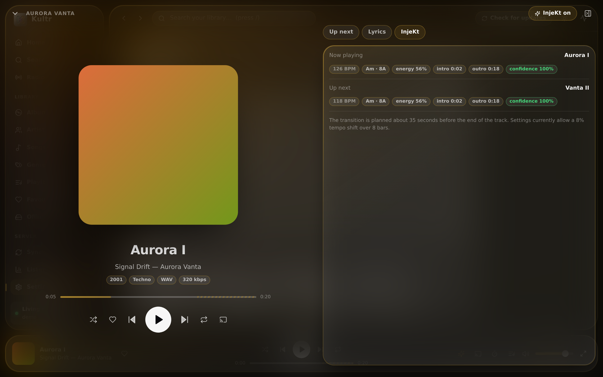 | 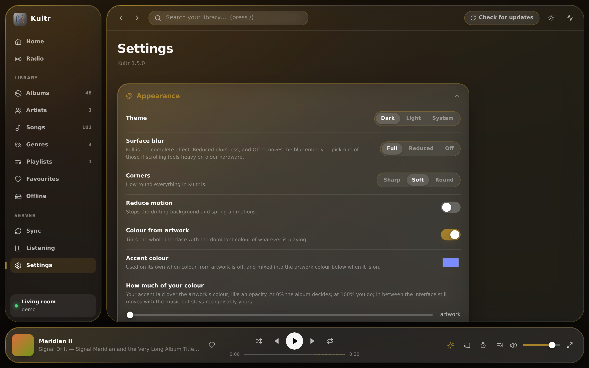 |
| **InjeKt, showing its working.** Tempo, key, energy and the exact plan for the hand-over. | **Make it yours.** Accent colour, borders, corner style, and six playhead designs that preview themselves. |
| 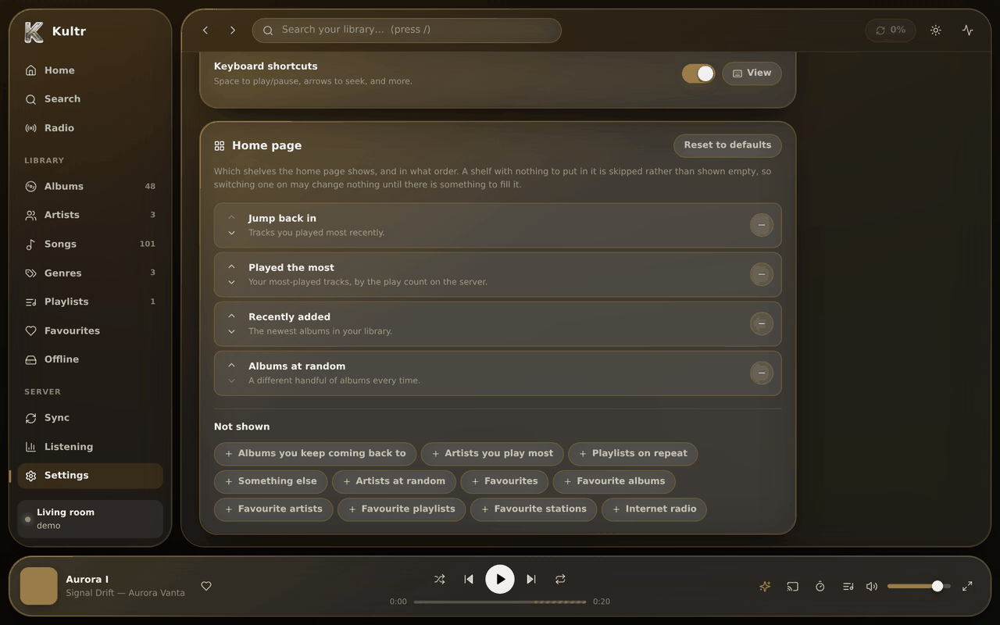 | 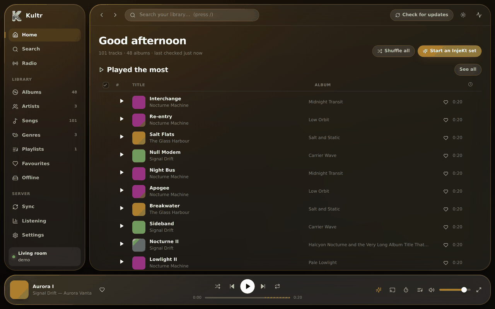 |
| **Choose your home page.** Fifteen shelves, switched on and off and put in the order you want. | **And here it is.** Empty shelves are skipped, so it never looks half-finished. |
| 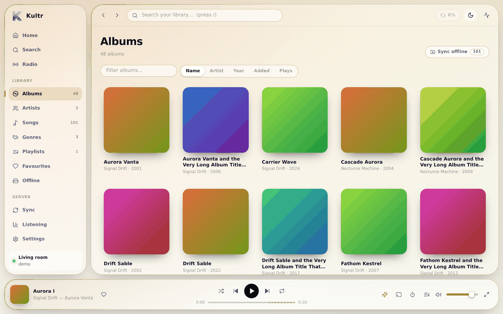 | 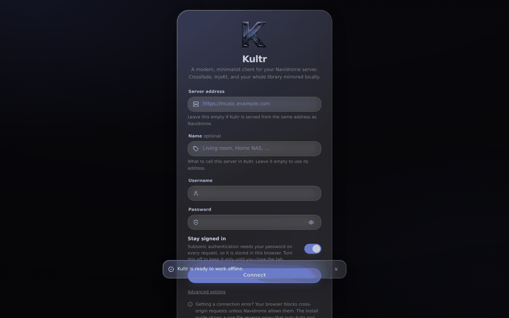 |
| **Light theme.** The same app icon, in the corner, reads on either background. | **One screen to connect.** Name the server, or let it use its address. |

<div align="center">

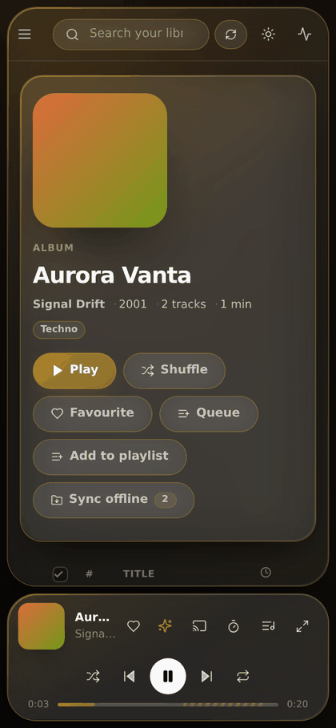
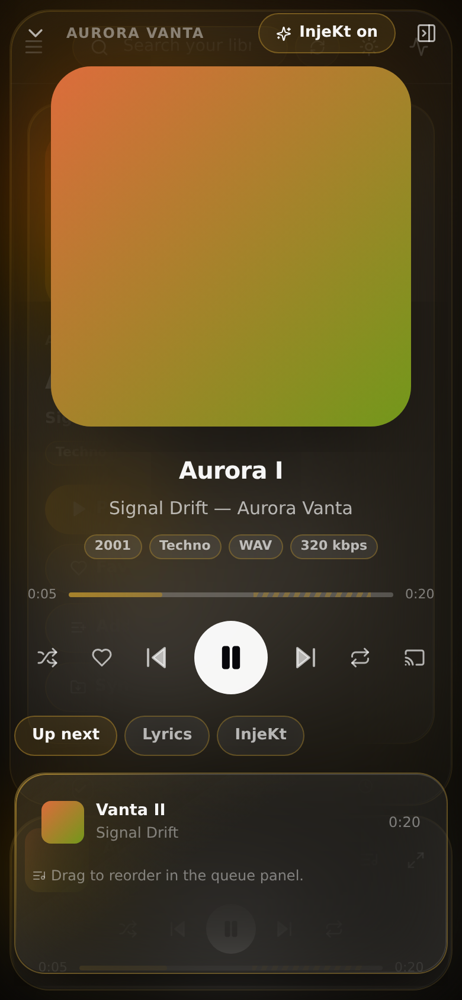

*On a phone, installed as a PWA.*

</div>

---

## What it does

|  | |
|---|---|
| **Full library sync** | One button mirrors every artist, album, track, playlist and genre into your browser. Browsing, sorting and searching are then instant and work with the server switched off. A second button checks for changes and pulls in only what moved. |
| **Crossfade** | Real dual-deck overlap with a configurable length (0–20s) and four fade shapes. Not a volume trick on one player — two decks actually play at once. |
| **InjeKt** | Beat-matched, key-aware transitions. Kultr works out each track's tempo, musical key, energy and where its intro and outro are, then blends like a DJ: it starts at the outro, eases *both* tracks onto a shared tempo, swaps the basslines over and skips long intros. [How it works →](docs/INJEKT.md) |
| **Gapless** | Turn crossfade off and the next track starts the instant the current one ends. |
| **Offline sync** | A sync button on every page — albums, artists, songs, genres, playlists, favourites, or the whole library. It is incremental: run it again and it only fetches what you do not already have. Downloads go into the browser, or into a real folder you pick, with readable `Artist - Album - Track` filenames. |
| **Select and act in bulk** | Tick boxes on tracks and cards (shift-click for a range), then download, delete, queue, favourite or add to a playlist in one go. |
| **Drag and drop** | Drag any track, album or artist onto a target: play next, add to queue, favourite, sync offline, or delete downloads. |
| **Listening, kept on your server** | Every play is sent to Navidrome with the time it happened, so *recently played*, *most played* and the Listening page are the same on every device and come back after clearing the browser. Plays made offline are queued and sent when the connection returns; plays made on other devices show up when you come back to the tab. |
| **Many servers** | Add as many Navidrome servers as you like, give each one a name, switch between them, and turn one off without deleting it. |
| **A home page you choose** | Fifteen shelves — most played, random, favourite and recently added, across tracks, albums, artists, playlists and radio — switched on, off and reordered to taste. A shelf with nothing to show is skipped rather than left empty. |
| **Cast** | Send playback to a Chromecast or an AirPlay device, where the browser supports it. |
| **Make it yours** | Light and dark, three corner styles, six playhead designs, borders that take the accent colour, opacity sliders for both, and an accent you can blend with the artwork's rather than choosing between the two. Click the time in the player to count down instead of up. |
| **Custom CSS** | A box in Settings for your own stylesheet, applied last so it overrides everything. |
| **Settings backup** | Export every preference to a small JSON file and import it on another machine. Passwords and usernames are never in it; the list of servers is left out too unless you explicitly ask for it. |
| **Equaliser** | Ten bands, nine presets, pre-amp. |
| **Volume levelling** | ReplayGain, per track or per album, with clipping protection. |
| **Lyrics** | Synced line-by-line when your files have them, plain text otherwise. |
| **Everything else** | Queue with drag-to-reorder, favourites, ratings, playlists, sleep timer, internet radio, keyboard shortcuts, light and dark themes, and a PWA install on desktop, Android and iOS. |

The interface takes its colour from whatever is playing — the surfaces, the
highlights and the backdrop all retint from the album art. It moves, too, but
quickly: the highlight in the sidebar and in every switcher slides to what you
picked, settings sections grow open and shut, pages rise into place, and the
full player, the queue, dialogs, menus and notices leave the way they came
instead of vanishing. **Reduce motion** in Settings (or the system setting)
turns all of it off.

Search lives in the top bar: type anywhere, and results appear as you type.
Press <kbd>/</kbd> to jump to it.

---

## Install

Three ways, fastest first. All of them end up at **http://localhost:4180**.

> **Which one should I pick?**
> Already run Navidrome in Docker → [A](#a-docker-with-navidrome-you-already-run).
> Starting from nothing → [B](#b-docker-navidrome--kultr-together).
> No Docker, or you want to hack on it → [C](#c-from-source).

### A. Docker, with Navidrome you already run

```bash
git clone https://github.com/evropiani/Kultr.git
cd Kultr
docker compose up -d
```

Then open **http://localhost:4180**.

If your Navidrome is not reachable at `http://host.docker.internal:4533`, point
Kultr at it and restart:

```bash
# Edit the address, then restart
sed -i 's|http://host.docker.internal:4533|http://192.168.1.10:4533|' docker-compose.yml
docker compose up -d --force-recreate
```

On the login screen, **leave the server field blank** and enter your Navidrome
username and password. (Blank works because Kultr is proxying Navidrome for you
— see [Why the server field can be blank](#why-the-server-field-can-be-blank).)

### B. Docker, Navidrome + Kultr together

Starting from nothing. This brings up both, wired together.

```bash
git clone https://github.com/evropiani/Kultr.git
cd Kultr

# Point this at your music folder
echo "MUSIC_DIR=/path/to/your/music" > .env

docker compose -f docker-compose.full.yml up -d
```

Then:

1. Open **http://localhost:4533** and create your Navidrome account. *(Do this
   first — the first account you create becomes the admin.)*
2. Wait for the first scan to finish.
3. Open **http://localhost:4180**, leave the server field blank, and log in with
   the account you just made.
4. Press **Sync my library**.

<details>
<summary>Windows (PowerShell) version of the same thing</summary>

```powershell
git clone https://github.com/evropiani/Kultr.git
cd Kultr

# Use forward slashes, even on Windows
"MUSIC_DIR=C:/Users/you/Music" | Out-File -Encoding utf8 .env

docker compose -f docker-compose.full.yml up -d
```
</details>

### C. From source

You need [Node.js 20 or newer](https://nodejs.org/). Check with `node --version`.

```bash
git clone https://github.com/evropiani/Kultr.git
cd Kultr
npm install
npm run build

# Serve it, proxying your Navidrome so there is nothing else to configure
KULTR_NAVIDROME_URL=http://localhost:4533 npm run serve
```

Open **http://localhost:4180** and leave the server field blank.

<details>
<summary>Windows (PowerShell)</summary>

```powershell
git clone https://github.com/evropiani/Kultr.git
cd Kultr
npm install
npm run build

$env:KULTR_NAVIDROME_URL = "http://localhost:4533"
npm run serve
```
</details>

<details>
<summary>Keep it running after you close the terminal (Linux, systemd)</summary>

```bash
sudo tee /etc/systemd/system/kultr.service > /dev/null <<'EOF'
[Unit]
Description=Kultr
After=network.target

[Service]
Type=simple
User=YOUR_USER
WorkingDirectory=/opt/kultr
Environment=PORT=4180
Environment=KULTR_NAVIDROME_URL=http://localhost:4533
ExecStart=/usr/bin/node server/serve.js
Restart=on-failure

[Install]
WantedBy=multi-user.target
EOF

# Adjust YOUR_USER and the path above, then:
sudo systemctl daemon-reload
sudo systemctl enable --now kultr
sudo systemctl status kultr
```
</details>

More detail, including macOS, a Raspberry Pi and putting it on a real domain
with HTTPS: **[docs/INSTALL.md](docs/INSTALL.md)**.

---

## First run

1. **Log in.** Leave the server address blank if Kultr is proxying Navidrome
   for you (options A, B and C above). Otherwise type the full address, e.g.
   `https://music.example.com`.
2. **Press “Sync my library”** on the Sync page. One request per album, so a
   few thousand albums take a minute or two. It only happens once.
3. **Press “Analyse missing”** under InjeKt analysis if you want every
   track measured in advance. This streams each track once at a low bitrate —
   it is optional: Kultr also analyses the playing track and the next one the
   moment a track starts, and plans the transition then.

After that, **Check for updates** re-reads the album index and only pulls what
actually changed. Kultr also does this automatically on startup and hourly,
which you can change on the Sync page.

---

## Why the server field can be blank

Every install option above runs Kultr's own small server, which **forwards
`/rest` and `/share` to Navidrome**. The app and the music server then share
one address, so leave the field blank and the app talks to the address it was
loaded from.

Typing an address instead — or using the hosted app at
[web.kultr.cc](https://web.kultr.cc/) — makes the browser talk to your server
directly, across addresses. A browser only allows that when the server says it
may (the rule is called CORS), and **Navidrome says so out of the box**: it has
sent the header on every API and audio response for years. So a plain
Navidrome works either way, the equaliser and InjeKt's bass swap included.

When a direct connection fails, the usual reasons are:

- **An `http://` server with the HTTPS app.** An HTTPS page cannot call a
  plain `http://` address, so the server needs HTTPS too.
- **A proxy in front of Navidrome that adds its own CORS header.** Navidrome
  already sends one, and browsers block responses that carry two.
- **A login gateway** (Authelia, Authentik, Cloudflare Access…) that answers
  `/rest` requests with its own login page.
- **A server other than Navidrome** that does not send the header on its audio.

[docs/CORS.md](docs/CORS.md) has a diagnosis table and the fixes, and there
are ready-made [Caddy](deploy/Caddyfile) and [nginx](deploy/nginx.conf)
configs that put Kultr and Navidrome on one address.

---

## InjeKt

Kultr's mixing engine. The name is literal: it *injects* one track into the
next rather than laying one on top of the other.

Kultr decodes each track once and measures it: tempo and beat grid, musical key
(Camelot notation, for harmonic mixing), loudness and brightness, and the points
where the intro ends and the outro begins. As soon as a track starts playing,
it measures the next one too and plans the hand-over between them from those
numbers — so there is the whole track's length to get it ready, and the plan
is remade if the queue changes:

- **Beat-matching, from both sides** — rather than dragging the new track onto
  the old one's tempo, Kultr picks a tempo between them and moves both. The
  track you are listening to drifts into it over eight of its own bars before
  the blend even starts, so the two are already locked when the next one
  appears; afterwards the new track eases back to its natural tempo. Each side
  therefore moves half as far, which is half as audible, and pairs that a
  one-sided match would reject now work — the limit you set (default 8%)
  applies per track, so it covers roughly twice the gap. Pitch is preserved
  throughout, and **Settings → InjeKt → Tempo share** decides how the work is
  split (0% is the old one-sided behaviour).
- **Bar alignment** — the blend starts on a downbeat of the outgoing track and
  the incoming track enters on one of its own, so the grids actually line up.
- **Bass swap** — the outgoing bass rolls off before the incoming bass comes up,
  so two kick drums never fight.
- **Harmonic mixing** — when the two keys clash, it filter-sweeps out of the old
  track instead of blending into a muddy chord.
- **Intro skipping** — brings the next track in at its first real downbeat
  rather than 20 seconds of ambient pad.
- **Auto-continuation** — when the queue empties, it keeps going with tracks
  chosen by tempo, key and energy proximity, so the set keeps flowing.

Every part degrades gracefully. No analysis yet, tempos too far apart, or Web
Audio unavailable, and it quietly becomes a good ordinary crossfade. Open the
**InjeKt** tab in the full-screen player to see exactly what it decided and why.

There is a toggle in the player bar and in the full-screen player, so you can
switch it off mid-listen without opening settings.

Details and tuning: **[docs/INJEKT.md](docs/INJEKT.md)**.

---

## Configuration

Everything that matters is in Settings. These are for deployment.

| Variable | Used by | Default | What it does |
|---|---|---|---|
| `KULTR_NAVIDROME_URL` | `npm run serve`, Docker | *(unset)* | Reverse-proxy `/rest` and `/share` to this Navidrome. Setting it is what makes the blank server field work. |
| `PORT` | `npm run serve`, Docker | `4180` | Port to listen on. |
| `HOST` | `npm run serve`, Docker | `0.0.0.0` | Address to bind. |
| `KULTR_BASE` | build | `/` | Public path, if serving from a sub-directory. |
| `KULTR_PROXY_TARGET` | `npm run dev` | *(unset)* | Navidrome to proxy during development. |
| `VITE_NAVIDROME_URL` | build | *(unset)* | Pre-fills the server field. |
| `VITE_LOCK_SERVER` | build | *(unset)* | `1` hides the server field entirely. |
| `MUSIC_DIR` | `docker-compose.full.yml` | `./music` | Your music folder on the host. |

Copy [`.env.example`](.env.example) to `.env` to set them.

The download location is deliberately *not* here: browsers only allow writing
to a folder the person has picked in a file dialog, so it is chosen in
**Settings → Offline** rather than configured on the server.

---

## Keyboard shortcuts

| | | | |
|---|---|---|---|
| <kbd>Space</kbd> | Play / pause | <kbd>M</kbd> | Mute |
| <kbd>←</kbd> <kbd>→</kbd> | Seek 5s | <kbd>S</kbd> | Shuffle |
| <kbd>Shift</kbd>+<kbd>←</kbd> <kbd>→</kbd> | Previous / next | <kbd>R</kbd> | Repeat |
| <kbd>↑</kbd> <kbd>↓</kbd> | Volume | <kbd>L</kbd> | Favourite |
| <kbd>/</kbd> | Search | <kbd>Q</kbd> | Queue |
| <kbd>D</kbd> | Toggle InjeKt | <kbd>F</kbd> | Full player |
| <kbd>?</kbd> | All shortcuts | <kbd>Esc</kbd> | Close, or clear selection |

---

## Casting

Kultr can hand playback to another device: the **cast** button in the player
bar and in the full player opens whatever picker the browser provides —
Chromecast and friends through the Remote Playback API in Chromium, AirPlay in
Safari. Firefox has neither, so the button does not appear there at all rather
than sitting inert.

Two things worth knowing, both inherent to how the web does this:

- The receiver is handed the **stream URL** and fetches it itself, so it has to
  be able to reach your Navidrome. On a home network that is normally fine;
  over a VPN or a tunnel that only your browser can use, it is not.
- Casting bypasses Web Audio, so the **equaliser, crossfade and InjeKt do not
  apply** — the device gets the plain file.

---

## Custom CSS

**Settings → Custom CSS** takes a stylesheet of your own and applies it last,
so it wins over everything else. Useful variables: `--accent-r/g/b`,
`--glass-tint`, `--glass-edge`, `--ink`, `--r-lg`.

Kultr's class names are not a stable interface — they can change between
versions, and a rule that stops matching simply stops doing anything. CSS
cannot read your library or reach your server, so the worst a bad rule can do
is make the app look wrong; clearing the box undoes it. It *can* load images
and fonts from other sites, which tells those sites your IP address, so only
paste CSS you are willing to run.

---

## Your data

- Your password is kept in this browser, because Subsonic authentication needs
  it to hash a token on every request. Turn off **Stay signed in** and it is
  dropped when you close the tab. It is never sent anywhere except your own
  server.
- The library mirror, InjeKt analysis and this browser's own play history live
  in IndexedDB. **Settings → Reset Kultr** erases the lot.
- Play counts and last-played times live on your Navidrome server, which is
  where Kultr sends each play (**Settings → Playback → Send plays to
  Navidrome**). That is why recently and most played survive clearing the
  browser, and match across devices.
- Downloaded audio goes wherever you told it to: inside the browser, or a
  folder you picked. A page can only write where you have explicitly pointed
  it, so "choose a download path" means picking that folder once — there is no
  way for a website to be handed an arbitrary path, by design.
- Kultr talks to exactly one host: your Navidrome. No analytics, no telemetry,
  no third-party requests, no fonts loaded from anyone's CDN.

---

## Phones

**Android: there is a native app.**
**[Kultr for Android](https://github.com/evropiani/Kultr_Android)** is a proper
Android music app with the same behaviour: crossfade, InjeKt, the library
mirror, downloads, several servers — plus background playback, a media
notification, lock-screen and Bluetooth controls, and Android Auto. Download
the APK from its
[latest release](https://github.com/evropiani/Kultr_Android/releases/latest)
(Android 8.0 or later). A settings file exported from one opens in the other.

**Everywhere else**, Kultr is a PWA, so you can install it today: **Share →
Add to Home Screen** on iOS, or **Install app** from the Chrome or Edge menu.
It runs full-screen, keeps working offline for anything you have downloaded,
and shows up on the lock screen.

A native iOS app is planned, and the codebase is laid out for it — the player,
the sync engine and all of the InjeKt DSP are plain TypeScript with no DOM
dependencies, so they port as-is.
See **[docs/MOBILE.md](docs/MOBILE.md)**.

---

## Development

```bash
npm install

# Point the dev server at your Navidrome so there is no CORS to fight
echo "KULTR_PROXY_TARGET=http://localhost:4533" > .env
npm run dev

npm run typecheck   # TypeScript, strict
npm test            # DSP, InjeKt planner and settings-file suites
npm run check       # both
```

Architecture, where everything lives, and how to add a feature:
**[docs/DEVELOPMENT.md](docs/DEVELOPMENT.md)**.

---

## Documentation

| | |
|---|---|
| [INSTALL.md](docs/INSTALL.md) | Every install path, per OS, with HTTPS |
| [CORS.md](docs/CORS.md) | Why connections fail and how to fix them properly |
| [INJEKT.md](docs/INJEKT.md) | The DSP and the mixing rules |
| [SYNC.md](docs/SYNC.md) | What sync does, and what it costs your server |
| [DEVELOPMENT.md](docs/DEVELOPMENT.md) | Architecture and contributing |
| [MOBILE.md](docs/MOBILE.md) | Installing it on a phone, the Android app, and iOS to come |
| [TROUBLESHOOTING.md](docs/TROUBLESHOOTING.md) | When something is broken |
| [FAQ.md](docs/FAQ.md) | Short answers |
| [CHANGELOG.md](CHANGELOG.md) | What changed, and when |

---

## Compatibility

Kultr speaks the Subsonic API (v1.16.1) with the OpenSubsonic extensions
Navidrome provides. Navidrome is what it is built for and tested against, but
it was also tried against other Subsonic servers in September 2026, with a
tagged test library and every feature Kultr uses:

| Server | Result |
|---|---|
| **Navidrome** 0.64 | Everything works. |
| **Gonic** 0.22 | Works. Gonic counts Kultr's "now playing" notice as a play, so each play is counted twice. |
| **Supysonic** 0.7 | Works with **Send the password in plain form** switched on (login screen → Advanced options). No play counts. Its audio carries no CORS header, so run Kultr on the same address rather than using the hosted app. |
| **Ampache** 7.10 | Works with the plain-password switch. Keeps play counts for albums but not for tracks. |
| **Airsonic-Advanced** | Does not connect: it only accepts clients up to Subsonic API 1.15. |

Where a server lacks something Navidrome has — synced lyrics, BPM tags, artist
info, last-played times — Kultr falls back (plain lyrics, its own tempo
detection, this browser's play history) rather than breaking.

Needs a current browser: Chrome/Edge 111+, Firefox 113+, Safari 16.4+.
Older browsers fall back to a simpler player rather than breaking.

## How this was built

Kultr was **vibecoded with [Claude Code](https://claude.ai/code)**, Anthropic's
agentic coding tool. Every part of it — the Subsonic client, the two-deck audio
engine, the tempo and key detection, the interface CSS, the reverse proxy,
the tests, the install guides and the deployment workflows — was produced by
prompting Claude Code rather than typed by hand.

That is worth knowing for two reasons. It is a fair thing to disclose, and it
tells you what kind of codebase this is: the comments explain *why* rather than
*what*, the DSP is covered by real tests because the agent could run them, and
the whole thing is structured to be readable by whoever (or whatever) picks it
up next.

Issues and pull requests are welcome either way — or find me on Discord,
[@evropiani](https://discord.com/users/319246364246540288).

## License

[Apache 2.0](LICENSE).
